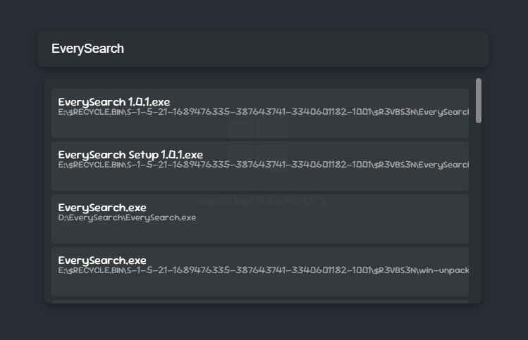

## EverySearch

File search made with [NodeJS](https://github.com/nodejs/node) and [Electron](https://github.com/electron/electron)

Search engine using [Everything](https://www.voidtools.com/)

## How to use

1. Download the last [Releases](https://github.com/AsZer0s/EverySearch/releases/latest)

2. Run `EverySearch`

3. Use the shortcut keys `Alt` + `Space` to open the main window

4. To exit the program, `right-click` the menu bar icon and click `Exit`

## Screenshot

MainWindows

SearchWindows

